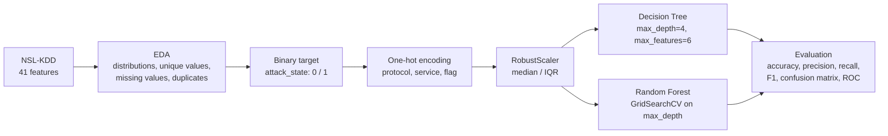

# Cloud Security — Threat Detection with Machine Learning

> Academic mini-project (**P157**, ENSAM Casablanca, group **CS2C-7**): detecting malicious network activity with **Decision Tree** and **Random Forest** classifiers, as the detection layer a cloud SIEM could use to flag suspicious traffic. Experiments run on the **NSL-KDD** intrusion detection benchmark.


---

## Table of contents

- [Context](#context)
- [Dataset](#dataset)
- [Approach](#approach)
- [Results](#results)
- [Lessons learned](#lessons-learned)
- [Getting started](#getting-started)
- [Repository structure](#repository-structure)
- [Limitations](#limitations)
- [Roadmap](#roadmap)
- [Authors](#authors)

---

## Context

Cloud providers have to monitor large volumes of network activity to spot attacks early. **SIEM** systems centralize this activity, but the rules they rely on only catch threats someone has already described. Machine learning can learn what malicious traffic looks like from labeled examples.

**Question studied:** how well can classical, interpretable models — a Decision Tree and a Random Forest — separate normal connections from attacks?

The [Abstract](./Abstract) describes the project's motivation in more detail.

## Dataset

[NSL-KDD](https://www.unb.ca/cic/datasets/nsl.html) (Canadian Institute for Cybersecurity) is the reference benchmark for network intrusion detection. Each row is one network connection described by **41 features**: connection basics (`duration`, `protocol_type`, `service`, `src_bytes`…), session content (`num_failed_logins`, `root_shell`…) and traffic statistics over recent connections (`count`, `serror_rate`, `dst_host_count`…).

| File | Connections | Normal | Attacks | Attack types |
|---|---:|---:|---:|---:|
| `KDDTrain+.txt` | 125,973 | 67,343 | 58,630 | 22 |
| `KDDTest+.txt` | 22,544 | 9,711 | 12,833 | 37 — of which **17 never appear in training** |

The attacks belong to four families: **DoS** (`neptune`, `smurf`…), **Probe** (`satan`, `portsweep`, `nmap`…), **R2L** — remote to local (`guess_passwd`, `warezclient`…) and **U2R** — user to root (`buffer_overflow`, `rootkit`…). The task here is **binary**: normal (0) vs. attack (1).

> NSL-KDD is network traffic captured in a lab in 1998, not cloud logs. It's used here as a well-known, labeled stand-in for the traffic a cloud SIEM would monitor.

## Approach



1. **Exploration** — attack type distribution, categorical values (3 protocols, 70 services, 11 flags), checks for missing values and duplicates (none).
2. **Preprocessing** — one-hot encoding of the three categorical features, then **RobustScaler**, which scales with the median and interquartile range so that extreme values (e.g. `src_bytes` up to 1.3 GB) don't dominate.
3. **Decision Tree** — deliberately shallow (`max_depth=4`) and restricted (`max_features=6`) to stay readable and limit overfitting; the tree is plotted in the notebook.
4. **Random Forest** — `max_depth` tuned with `GridSearchCV` (3-fold cross-validation, values from 1 to 30; best: 13).
5. **Evaluation** — accuracy, precision, recall, F1-score, confusion matrix and ROC curve.

## Results

### Reported in the notebook

| Model | Accuracy | Precision | Recall | F1-score |
|---|:---:|:---:|:---:|:---:|
| Decision Tree | 86.4 % | 93.9 % | 76.0 % | 84.0 % |
| Random Forest | 100 % | 100 % | 100 % | 100 % |

These scores come from a 25 % split of `KDDTrain+`. **They overestimate the models**, for the two reasons explained in [Lessons learned](#lessons-learned).

### Corrected evaluation

Trained on `KDDTrain+`, evaluated on the official test set `KDDTest+`, with the label columns removed from the features:

| Model | Accuracy | Precision | Recall | F1-score |
|---|:---:|:---:|:---:|:---:|
| Decision Tree (`max_depth=4`, `max_features=6`) | 73.9 % | 98.9 % | 54.8 % | 70.5 % |
| Random Forest (default) | 76.5 % | 96.7 % | 60.8 % | 74.7 % |
| Random Forest (`max_depth=13`, from the grid search) | **77.2 %** | 96.8 % | **62.0 %** | **75.6 %** |

*Positive class: attack. The Decision Tree picks 6 random features at each split, so its accuracy varies between 64 % and 77 % depending on the random seed (71 % on average over 10 seeds).*

**Reading the table:**

- **Precision is very high (97–99 %)** — an alert is almost always a real attack, which keeps analysts from drowning in false positives.
- **Recall is the weak point (55–62 %)** — about 4 attacks in 10 go unnoticed, mostly the attack types the models never saw during training.
- **Random Forest beats the single tree** on accuracy, recall and stability, as expected from bagging.

## Lessons learned

Two evaluation pitfalls explain the gap between the 100 % in the notebook and the ~77 % above. Both are common in intrusion detection papers, which makes them worth understanding.

**1. Label leakage.** The feature matrix is built with three successive `drop()` calls, each starting again from the full table:

```python
X_train = Trained_Data.drop('attack', axis=1)
X_train = Trained_Data.drop('level', axis=1)        # overwrites the previous line
X_train = Trained_Data.drop('attack_state', axis=1) # overwrites again
```

Only the last one takes effect, so the model is trained **with the attack type itself** (`attack`, label-encoded) as an input feature. That column is the **most important feature** of the trained Random Forest, which can then read the answer instead of learning it. The fix removes all three label columns at once:

```python
X_train = Trained_Data.drop(columns=['attack', 'level', 'attack_state'])
```

**2. Testing on the training distribution.** The models are evaluated on a split of `KDDTrain+`, never on `KDDTest+`. Even without leakage, a random split gives ~99.9 % for the Random Forest, because test rows closely resemble training rows. `KDDTest+` was designed to measure something harder — detecting **17 attack types absent from training** — and that is where the real ~77 % comes from.

Both pitfalls inflate results in the same direction, so a near-perfect score on NSL-KDD should always be questioned before it's reported.

## Getting started

```bash
git clone https://github.com/AyoubElmortaji/Cloud-Security.git
cd Cloud-Security

# Create an isolated environment for the project's packages
python3 -m venv .venv
source .venv/bin/activate          # on Windows: .venv\Scripts\activate

pip install numpy pandas matplotlib seaborn scikit-learn mlxtend statsmodels jupyter

# The notebook loads the data files from its own folder
cd "CS2C_07-P157-Code source"
jupyter notebook code.ipynb
```

## Repository structure

```
Cloud-Security/
├── Abstract                          # project abstract
├── README.md
└── CS2C_07-P157-Code source/
    ├── code.ipynb                    # EDA, preprocessing, Decision Tree, Random Forest
    ├── KDDTrain+.txt                 # NSL-KDD training set
    └── KDDTest+.txt                  # NSL-KDD test set
```

## Limitations

- **Not cloud data.** NSL-KDD is 1998 lab traffic. It contains no cloud-specific signals (API calls, IAM activity, VPC flow logs) and no modern or encrypted traffic.
- **Binary only.** The models say *attack* or *normal*, not which family (DoS, Probe, R2L, U2R).
- **Notebook issues.** Besides the leakage above, the first row of each file is read as a header (`pd.read_csv` without `header=None`), the train and test sets are encoded separately (124 vs. 118 columns), and the last cell compares the models on a synthetic dataset (`make_classification`) rather than on NSL-KDD.
- **Offline.** Detection runs on pre-computed connection records, not on live traffic.

## Roadmap

- [ ] Fix the leakage and evaluate on `KDDTest+` in the notebook
- [ ] Wrap preprocessing and model in a scikit-learn `Pipeline`, fitted on training data only
- [ ] Multi-class classification by attack family
- [ ] Add anomaly detection (Isolation Forest) to catch unseen attacks
- [ ] Use a cloud-native dataset: **AWS VPC Flow Logs**, **CloudTrail** events, or CIC-IDS2018 (captured on AWS)
- [ ] Send predictions to a SIEM (e.g. alerts in Wazuh or Microsoft Sentinel)

## Authors

Mini-project **P157 — Analyse et détection des menaces dans des environnements cloud avec machine learning**, group **CS2C-7**, ENSAM Casablanca.

**Ayoub ELMORTAJI** — Engineering student in Cybersecurity & Cloud Computing · [GitHub](https://github.com/AyoubElmortaji)

Dataset: [NSL-KDD](https://www.unb.ca/cic/datasets/nsl.html), Canadian Institute for Cybersecurity, University of New Brunswick.
